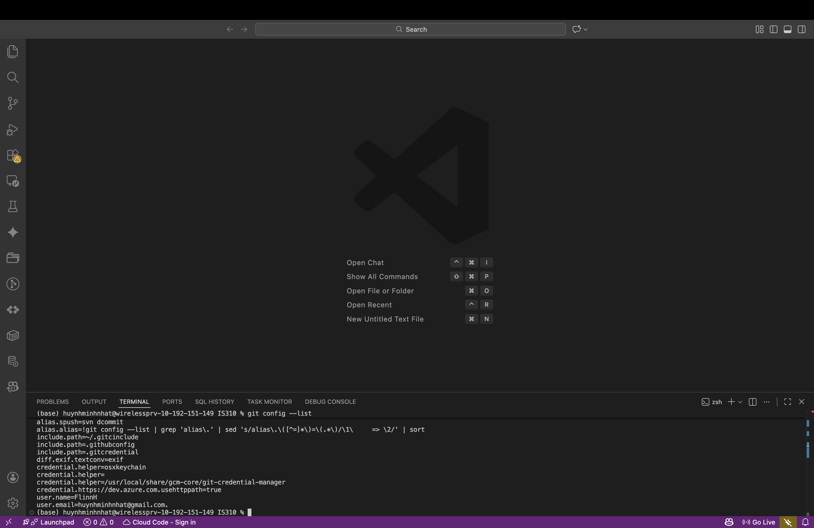

# Init IS310 Homework

## Proof of Installation

1. Python AND Git

2. VS Code

3. Hypothesis

Hypothesis Username: **Fhuynh2**

4. AI Tool/Workflow

I'm planning to utilize a wide range of models to assist me mostly in summarizing information that I found and optimizing my code's algorithms (my original idea). My options would range from GPT to Claude to Gemini.
