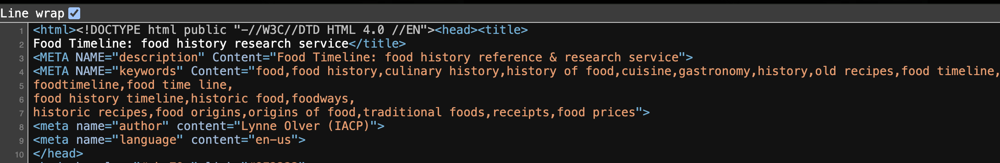

# Chosen Digital Source
- [The Food Timeline](https://www.foodtimeline.org/) which was launched on `March 1999` and last update on `August 2024`

### What web technologies were used?
- This site appears to be built with **static, hand-coded HTML**. It is a classic example of late 1990s/early 2000s web design.

- Visuals: The design relies modern **CSS** frameworks. I can see example like: ``

Evidence from Screenshot/Context: 

- File Extensions: When look at the URL structure or "View Source," I see .html files. The "timeline" itself is likely just one massive HTML document with "anchor tags" (Example: `<a href="foodlobster.html#oysters">oysters</a>`)

***NOTE:***
- Lack of Scripting: Unlike modern sites (like TikTok or Instagram) that require heavy JavaScript (.js) to load content dynamically, this site loads everything at once. This makes it incredibly fast and stable but harder to update.

### Who built this website?
- **Original Creator**: 
    - The site was created and maintained for decades by a single individual: *Lynne Olver*.
    - **How I can tell**: The text explicitly references "Lynne Olver's collection" and her "research files". It was originally a "passion project" by a reference librarian, not a corporate product.

- **Current Maintainers**: 
    - It is now preserved by `Virginia Tech University Libraries`. The update note mentions "our colleagues in Metadata Services" and links to Virginia Tech resources.

- **Team Size**:
    - Historically: 1 person (Lynne Olver).
    - Currently: A small institutional team (archivists and metadata specialists) at Virginia Tech who are fixing "broken links" and processing her physical books.

### Extra Notes
Does it have a GitHub? 
- I believe very likely `No`. Because this site predates the popularity of `GitHub`. It was likely built by editing files directly on a server via FTP (File Transfer Protocol).